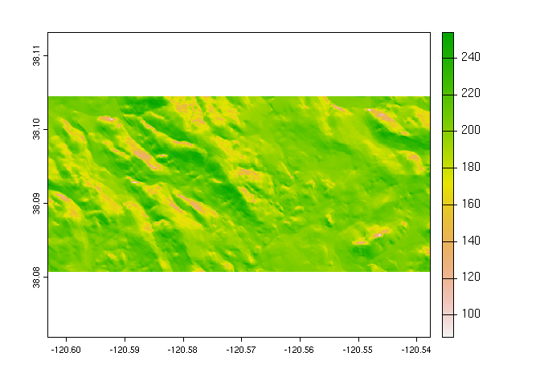

<!-- README.md is generated from README.Rmd. Please edit that file -->

# {rgeedim}

<!-- badges: start -->

[](https://github.com/brownag/rgeedim/actions)
[](https://humus.rocks/rgeedim/)
<!-- [](https://codecov.io/gh/brownag/rgeedim/) -->
<!-- badges: end -->

{rgeedim} supports search and download of Google Earth Engine imagery
with Python `geedim`.

## Installation

You can install the development version of {rgeedim} using {remotes}:

``` r
# install.packages("remotes")
remotes::install_github("brownag/rgeedim")
```

### External Dependencies

You will need Python, and the `geedim` module, installed on your
computer in order to successfully use {rgeedim}.

You can install `geedim` with `pip`, for example:

``` sh
python -m pip install geedim
```

There are numerous dependencies that may need to be satisfied. Perhaps
the most demanding are those for `rasterio`/GDAL.

If you have trouble compiling the packages yourself on Windows, you can
take advantage of the unofficial `pip` wheels (binaries) prepared by by
[Christoph Gohlke](https://www.cgohlke.com/):
<https://www.lfd.uci.edu/~gohlke/pythonlibs/>. *Note the specific
version of Python you are installing for.* Download the desired
package/version and then call `pip install your-package.whl`.

## Example

This example shows how to extract a Google Earth Engine asset by name
for an arbitrary extent. The coordinates of the bounding box are
expressed in WGS84 decimal degrees (`"OGC:CRS84"`).

``` r
library(rgeedim)
gd_initialize()

r <- gd_bbox(
  xmin = -120.6032,
  xmax = -120.5377,
  ymin = 38.0807,
  ymax = 38.1043
)

# US NED CHILI (Continuous Heat-Insolation Load Index)
# https://developers.google.com/earth-engine/datasets/catalog/CSP_ERGo_1_0_US_CHILI
res <- 'CSP/ERGo/1_0/US/CHILI' |>
  gd_image_from_id() |>
  gd_download(
    filename = 'image.tif',
    region = r,
    scale = 10, # scale=10: request ~10m resolution (result in native CRS)
    overwrite = TRUE,
    silent = FALSE
  )
```

``` r
library(terra)
#> terra 1.5.34

f <- rast(res)
plot(f[[1]])
```



``` r

f
#> class       : SpatRaster 
#> dimensions  : 264, 730, 2  (nrow, ncol, nlyr)
#> resolution  : 8.983153e-05, 8.983153e-05  (x, y)
#> extent      : -120.6032, -120.5377, 38.08066, 38.10438  (xmin, xmax, ymin, ymax)
#> coord. ref. : lon/lat NAD83 (EPSG:4269) 
#> source      : image.tif 
#> names       : constant, FILL_MASK
```
